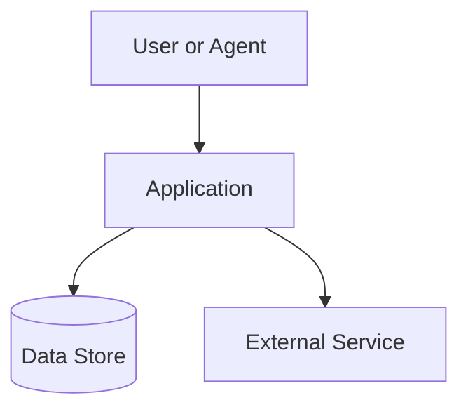

# Diagram Plan Template

## Diagram decision table

| Question | Diagram type | Audience | Source files | Output format |
|---|---|---|---|---|
| What talks to what? | Context or container | New devs | Architecture docs | Mermaid |
| How does a request flow? | Sequence | Devs/operators | Code/routes/logs | Mermaid |
| Where does data move? | Data flow | Security/data owners | Schemas/services | Mermaid |
| How is it deployed? | Deployment | Operators | Infra configs | Mermaid |

## Mermaid starter

## Rules

Keep one abstraction level per diagram. Add trust boundaries and external systems when relevant.
