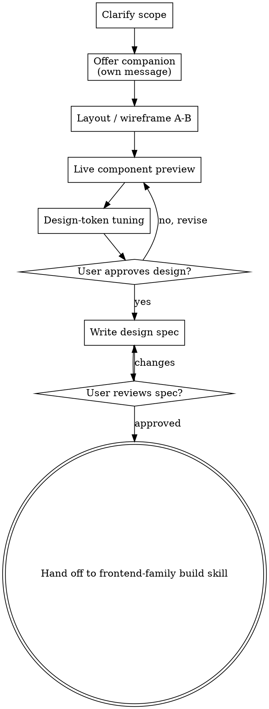

# Visual Design Studio

Turn a UI idea into a validated front-end design through a live, browser-based
loop. You push HTML screens to a local companion server; the user sees them in
their browser, clicks options and drags token controls; you read their choices
back and iterate. This skill is for **design decisions** (look, layout, tokens),
not implementation — it terminates by handing off to a `frontend-family` build skill.

<HARD-GATE>
Do NOT write production component code, scaffold a project, or invoke an implementation
skill until you have presented a design the user has approved. Mockups and throwaway
preview HTML written to the companion's `content/` directory are fine — that IS the design tool.
</HARD-GATE>

## When to use this skill

- Comparing **layout or wireframe** options before committing
- Iterating on a **live component preview** (real HTML/CSS/Tailwind, rendered)
- Tuning **design tokens** — color, spacing, type scale, radius — interactively
- Running a full **design → spec → build** flow for a new UI surface

If the user just wants a component built to a known spec, skip this and use
`component-library` / `tailwind-system` directly.

## Checklist

Create a task for each item and complete in order:

1. **Clarify scope** — what surface, who's it for, brand/constraints, target stack (React/Vue/Svelte/plain, Tailwind or not)
2. **Offer the visual companion** (its own message — see Visual Companion section)
3. **Layout / wireframe A-B** — show 2-4 layout directions, let the user pick
4. **Live component preview** — render the chosen direction as real components; iterate on look-and-feel
5. **Design-token tuning** — let the user adjust color/spacing/type; read the chosen `tokens.json`
6. **Write the design spec** — save to `docs/frontend/specs/YYYY-MM-DD-<surface>-design.md`, include the chosen tokens
7. **User reviews the spec**
8. **Hand off to implementation** — invoke the right `frontend-family` skill (`component-library`, `tailwind-system`, `local-apps`, `quick-dashboard`, …). Do NOT invoke `pipeline-family:implement`; this is a front-end handoff.

## Core procedure

**The terminal state is handing off to a `frontend-family` implementation skill** with
the approved design and chosen tokens.

## Key Principles

- **One decision per screen** — don't crowd layout, components, and tokens together
- **2-4 options max** per A/B screen
- **Real content when it matters** — for a portfolio use real images (Unsplash); placeholders hide design problems
- **Scale fidelity to the question** — wireframe for layout, polished render for look-and-feel
- **Read tokens, don't guess** — after token tuning, read `state/tokens.json` for the exact chosen values and carry them into the spec
- **YAGNI** — strip features that don't serve the surface
- **Accessibility** — keep WCAG AA contrast in mind when proposing palettes

## Visual Companion

The browser companion is the core of this skill. Offer it once, as its own message:

> "I can show you these designs live in your browser — layout options, real component
> previews, and interactive color/spacing controls you can drag while I watch. Want me
> to open it? (Requires opening a local URL. Still new and somewhat token-intensive.)"

**This offer MUST be its own message** — no clarifying question stacked on it. Wait for
consent. If declined, run text-only with ASCII/description and `AskUserQuestion` for choices.

Once accepted, read the full loop guide before starting the server:
`visual-companion.md`

## Output format

This skill terminates by producing a **design spec** — the handoff artifact a
`frontend-family` build skill consumes. The spec captures the *approved* design
(not implementation code) and includes:

- **Layout** — chosen wireframe/structure (which A/B option won, and why).
- **Design tokens** — exact values read from `state/tokens.json` (color, spacing,
  typography, radius), not guessed.
- **Components** — the previewed component set and their states.
- **Content & assets** — real image/content sources where fidelity matters.
- **Accessibility notes** — WCAG AA contrast results for the chosen palette.
- **Target** — user, device, runtime, and the build skill to hand off to.

Present the spec for user review before handing off; on approval, pass it to the
build skill at the `sonnet` tier (implementation is known-pattern code).

## Guardrails

- Limit work to the UI/frontend design layer; do not modify backend logic or APIs
- Validate accessibility (WCAG AA minimum) for proposed palettes and components
- Remind the user to add `.frontend/` to `.gitignore` if using `--project-dir`
